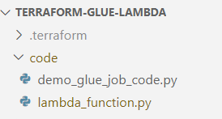

<!-- https://medium.datadriveninvestor.com/use-of-aws-glue-job-and-lambda-function-to-enhance-data-processing-703b183e5550 -->

# TERRAFORM: How to trigger a Lambda function from S3 to run Glue Job and clean up data.

# Background.
En este artículo podrás encontrar la implementación de los recursos necesarios para crear la la siguiente arquitecura en AWS para alcanzar el objetivo que se indica en el título de este documento.

La creación del codigo en terraform esta inspidada y basada en el artículo publicado por Steve George con el titulo "Use of AWS Glue Job and Lambda function to enhance data processing." Si deseas leer su artículo haz clic [aquí](https://medium.datadriveninvestor.com/use-of-aws-glue-job-and-lambda-function-to-enhance-data-processing-703b183e5550)


La implementación en terraform creará los recursos que se muestran en la arquitectura de la imagen 1.


<p style="text-align: center;">Imagen 1. Architecture.</p>

Recursos que serán creados en terraform son:

* El rol que tendra los permisos necesarios de ejecución de la función lambda y del Glue Job.
* S3 Bucket donde almacenaremos el archivo csv que procesaremos con el Glue Job
* El evento en S3 que disparará la función lambda
* La creación de la función lambda, el código en python para la función y su creación en la nube.
* La creación del job y la asignación del codigo en python.
* El S3 bucket donde almacenaremos el archivo resultante del proceso de la limpieza.

Iniciaremos con la creación del archivo `provider.tf` donde indicaremos el provedor en la nube que utilizaremos, la versión de hashicorp y la región donde desplegaremos los recursos. El archivo debe tener lo siguiente:
```
terraform {
  required_version = ">= 0.13"

  required_providers {
    aws = {
      source  = "hashicorp/aws"
      version = ">= 4.30"
    }
  }
}
provider "aws" {
  region = "us-east-2"
}
```

Ahora seguiremos con la declaración de las variables necesarias para nuestra aplicación, crea un archivo `variables.tf` que contenga lo siguiente:
```
#-----------------------------------------------------------
#                    IAM Variables
#-----------------------------------------------------------
variable "role_name" {
  description = "The name of the role"
  type        = string
}

variable "log_policy_name" {
  description = "The name of the log policy"
  type        = string
}
#-----------------------------------------------------------
#                    GLUE Variables
#-----------------------------------------------------------
variable "job_name" {
  description = "The name of the job"
  type        = string
}

variable "job_type" {
  description = "The type of the job"
  type        = string
}

variable "job_timeout" {
  description = "The timeout of the job"
  type        = string
}

variable "job_number_of_workers" {
  description = "The number of workers for the job"
  type        = string
}

variable "job_python_name" {
  description = "The name of the python script for the job"
  type        = string
}

#-----------------------------------------------------------
#                    S3 BUCKETS Variables
#-----------------------------------------------------------
variable "bucket_source_name" {
  description = "The name of the source bucket"
  type        = string
}

variable "bucket_target_name" {
  description = "The name of the target bucket"
  type        = string
}

variable "s3_acl" {
  description = "Access Control List for S3 Bucket"
  type        = string
}

variable "s3_bucket_versioning" {
  description = "S3 Bucket Versioning"
  type        = string
}

#-----------------------------------------------------------
#                   LAMBDA
#----------------------------------------------------------- 

variable "lambda_function_name" {
  description = "The name of the lambda function"
  type        = string
}

variable "lambda_runtime" {
  description = "The runtime of the lambda function"
  type        = string
}

variable "lambda_timeout" {
  description = "The timeout of the lambda function"
  type        = string
}

```
En el codigo anterior se observa que se ha dividido en secciones las variables para identificar en que archivo son utlizadas.

También debemos crear un archivo que contenga la inicialización de nuestras variables. El nombre de este archivo es `dev.tfvars` y su contenido es el siguiente:
```
#######################################################
#                   IAM
####################################################### 
role_name             = "glue_lambda_role"
log_policy_name       = "policies"
#######################################################
#                   GLUE JOB                         
####################################################### 
job_name              = "demo-glue-lambda-job"
job_type              = "G.1X"
job_timeout           = "1440"
job_number_of_workers = "2"
job_python_name       = "demo_glue_job_code.py"
#######################################################
#                       S3                      
####################################################### 
bucket_source_name   = "demo-glue-lambda-source0406"
bucket_target_name   = "demo-glue-lambda-target0406"
s3_acl               = "private"
s3_bucket_versioning = "Disabled"
#######################################################
#                    Lambda                      
####################################################### 
lambda_function_name = "demo-glue-lambda"
lambda_runtime       = "python3.9"
lambda_timeout       = "30"
```
Ahora crearemos un archivo donde indicaremos nuestros "local values". Esto nos permite simplificar nuestra configuración en terraform ya que reduce la duplicidad de código. El archivo lo llamaremos `locals.tf`. Definiremos en él los valores del formato para empaquetar el codigo fuente, al igual que las rutas de los archivos y deberá contener lo siguiente:
```
locals {
  compress_type         = "zip"
  glue_py_source_code   = "${path.cwd}/code/demo_glue_job_code.py"
  lambda_output_path    = "${path.cwd}/zip_files/lambda_function.zip"
  lambda_source_file    = "${path.cwd}/code/lambda_function.py"
}
```

En AWS debemos crear un rol y asignarle los permisos minimos necesarios para las tareas que realizará nuestra aplicación. En el codigo siguiente se asignaron los permisos que dan acceso completo a los recursos de s3, glue y otros mas. En un ambiente de producción deben revisarse estos permisos y remover los que no sean necesarios y lo que no provean mas acceso del necesario. Crearemos el archivo `iam.tf` que configura las actiones sobre los recursos de nuestra aplicación.

```
#######################################################
#                   IAM
####################################################### 
resource "aws_iam_role" "role" {
  name = var.role_name

  assume_role_policy = <<POLICY
{
  "Version": "2012-10-17",
  "Statement": [
    {
      "Action": "sts:AssumeRole",
      "Principal": {
        "Service": ["lambda.amazonaws.com","glue.amazonaws.com"]
      },
      "Effect": "Allow",
      "Sid": ""
    }
  ]
}
POLICY
}
#######################################################
#           ALLOW LAMBDA TO WRITE TO CLOUDWATCH
####################################################### 
resource "aws_iam_policy" "policies" {
  name        = var.log_policy_name
  path        = "/"
  description = "IAM policy for logging from a lambda"

  policy = <<EOF
{
  "Version": "2012-10-17",
  "Statement": [
    {
      "Action": [
        "logs:CreateLogGroup",
        "logs:CreateLogStream",
        "logs:PutLogEvents"
      ],
      "Resource": "arn:aws:logs:*:*:*",
      "Effect": "Allow"
    },
    {
      "Action": [
        "s3:*",
        "ses:*"
      ],
      "Effect": "Allow",
      "Resource": "*"
    },
    {
      "Action": [
        "glue:StartJobRun"
      ],
      "Effect": "Allow",
      "Resource": "arn:aws:glue:us-east-2:154499352692:job/demo-glue-lambda-job"
    },
    {
            "Effect": "Allow",
            "Action": [
                "autoscaling:Describe*",
                "cloudwatch:*",
                "logs:*",
                "sns:*",
                "iam:GetPolicy",
                "iam:GetPolicyVersion",
                "iam:GetRole",
                "oam:ListSinks"
            ],
            "Resource": "*"
        },
        {
            "Effect": "Allow",
            "Action": "iam:CreateServiceLinkedRole",
            "Resource": "arn:aws:iam::*:role/aws-service-role/events.amazonaws.com/AWSServiceRoleForCloudWatchEvents*",
            "Condition": {
                "StringLike": {
                    "iam:AWSServiceName": "events.amazonaws.com"
                }
            }
        },
        {
            "Effect": "Allow",
            "Action": [
                "oam:ListAttachedLinks"
            ],
            "Resource": "arn:aws:oam:*:*:sink/*"
        },
        {
            "Effect": "Allow",
            "Action": [
                "glue:*",
                "redshift:DescribeClusters",
                "redshift:DescribeClusterSubnetGroups",
                "iam:ListRoles",
                "iam:ListUsers",
                "iam:ListGroups",
                "iam:ListRolePolicies",
                "iam:GetRole",
                "iam:GetRolePolicy",
                "iam:ListAttachedRolePolicies",
                "ec2:DescribeSecurityGroups",
                "ec2:DescribeSubnets",
                "ec2:DescribeVpcs",
                "ec2:DescribeVpcEndpoints",
                "ec2:DescribeRouteTables",
                "ec2:DescribeVpcAttribute",
                "ec2:DescribeKeyPairs",
                "ec2:DescribeInstances",
                "ec2:DescribeImages",
                "rds:DescribeDBInstances",
                "rds:DescribeDBClusters",
                "rds:DescribeDBSubnetGroups",
                "s3:ListAllMyBuckets",
                "s3:ListBucket",
                "s3:GetBucketAcl",
                "s3:GetBucketLocation",
                "cloudformation:DescribeStacks",
                "cloudformation:GetTemplateSummary",
                "dynamodb:ListTables",
                "kms:ListAliases",
                "kms:DescribeKey",
                "cloudwatch:GetMetricData",
                "cloudwatch:ListDashboards"
            ],
            "Resource": [
                "*"
            ]
        },
        {
            "Effect": "Allow",
            "Action": [
                "s3:GetObject",
                "s3:PutObject"
            ],
            "Resource": [
                "arn:aws:s3:::aws-glue-*/*",
                "arn:aws:s3:::*/*aws-glue-*/*",
                "arn:aws:s3:::aws-glue-*"
            ]
        },
        {
            "Effect": "Allow",
            "Action": [
                "tag:GetResources"
            ],
            "Resource": [
                "*"
            ]
        },
        {
            "Effect": "Allow",
            "Action": [
                "s3:CreateBucket"
            ],
            "Resource": [
                "arn:aws:s3:::aws-glue-*"
            ]
        },
        {
            "Effect": "Allow",
            "Action": [
                "logs:GetLogEvents"
            ],
            "Resource": [
                "arn:aws:logs:*:*:/aws-glue/*"
            ]
        },
        {
            "Effect": "Allow",
            "Action": [
                "cloudformation:CreateStack",
                "cloudformation:DeleteStack"
            ],
            "Resource": "arn:aws:cloudformation:*:*:stack/aws-glue*/*"
        },
        {
            "Effect": "Allow",
            "Action": [
                "ec2:RunInstances"
            ],
            "Resource": [
                "arn:aws:ec2:*:*:instance/*",
                "arn:aws:ec2:*:*:key-pair/*",
                "arn:aws:ec2:*:*:image/*",
                "arn:aws:ec2:*:*:security-group/*",
                "arn:aws:ec2:*:*:network-interface/*",
                "arn:aws:ec2:*:*:subnet/*",
                "arn:aws:ec2:*:*:volume/*"
            ]
        },
        {
            "Effect": "Allow",
            "Action": [
                "ec2:TerminateInstances",
                "ec2:CreateTags",
                "ec2:DeleteTags"
            ],
            "Resource": [
                "arn:aws:ec2:*:*:instance/*"
            ],
            "Condition": {
                "StringLike": {
                    "ec2:ResourceTag/aws:cloudformation:stack-id": "arn:aws:cloudformation:*:*:stack/aws-glue-*/*"
                },
                "StringEquals": {
                    "ec2:ResourceTag/aws:cloudformation:logical-id": "ZeppelinInstance"
                }
            }
        },
        {
            "Action": [
                "iam:PassRole"
            ],
            "Effect": "Allow",
            "Resource": "arn:aws:iam::*:role/AWSGlueServiceRole*",
            "Condition": {
                "StringLike": {
                    "iam:PassedToService": [
                        "glue.amazonaws.com"
                    ]
                }
            }
        },
        {
            "Action": [
                "iam:PassRole"
            ],
            "Effect": "Allow",
            "Resource": "arn:aws:iam::*:role/AWSGlueServiceNotebookRole*",
            "Condition": {
                "StringLike": {
                    "iam:PassedToService": [
                        "ec2.amazonaws.com"
                    ]
                }
            }
        },
        {
            "Action": [
                "iam:PassRole"
            ],
            "Effect": "Allow",
            "Resource": [
                "arn:aws:iam::*:role/service-role/AWSGlueServiceRole*"
            ],
            "Condition": {
                "StringLike": {
                    "iam:PassedToService": [
                        "glue.amazonaws.com"
                    ]
                }
            }
        }
  ]
}
EOF
}

resource "aws_iam_role_policy_attachment" "attachment" {
  role       = aws_iam_role.role.name
  policy_arn = aws_iam_policy.policies.arn
}

```

Ahora crearemos un programa en python que tendrá la función lambda que ejecutará el glue job. El nombre de este archivo debe ser `lambda_function.py` y deberá estar dentro de un directorio llamado <strong>code</strong>. La imagen 2 muestra la estrcutura del directorio dónde debe ubicarse el archivo. 
<center>

<p style="text-align: center;">Imagen 2. Source Directory.</p>
</center>

La función lambda debe tener el siguiente código:

```
import json 
import boto3

def lambda_handler(event, context):
   glue = boto3.client("glue")
   file_name = event['Records'][0]['s3']['object']['key']
   bucket_name = event['Records'][0]['s3']['bucket']['name']
   print("File Name : ", file_name)
   print("Bucket Name : ",bucket_name)
   response = glue.start_job_run(
               JobName = "demo-glue-lambda-job",
               Arguments = {
                  "--file":   file_name,
                  "--bucket": bucket_name
                  }
               )
   print("Lambda invoke")
```
A continuación se define la infraestructura como código para el despligue de la función en los servicios de AWS. El archivo se llamará `lambda.tf` que crea el arhcivo zip para su carga a la nube y define las rutas de dónde se cargará el archivo, el nombre de la función y el rol asignado. El contenido de este archivo es:
```
data "archive_file" "lambda_zip_file" {
  type          = local.compress_type
  source_file   = local.lambda_source_file
  output_path   = local.lambda_output_path
}
#######################################################
#                   LAMBDA
####################################################### 
resource "aws_lambda_function" "lambda_fn" {
  function_name = var.lambda_function_name

  filename          = data.archive_file.lambda_zip_file.output_path
  source_code_hash  = data.archive_file.lambda_zip_file.output_base64sha256
  role              = aws_iam_role.role.arn
  runtime           = var.lambda_runtime
  handler           = "lambda_function.lambda_handler"
  timeout           = var.lambda_timeout

  depends_on = [
      data.archive_file.lambda_zip_file,
      aws_iam_role_policy_attachment.attachment,
      aws_cloudwatch_log_group.lambda_log_group,
    ]

}

```
Ha llegado el tiempo de crear nuestro glue job que se encargará de procesar un archivo cargado en un bucket de S3 y realizar los procesos de limpieza. Primero creremos el archivo `demo_glue_job_code.py` que tiene el código python que realiza la limpieza del archivo, cree este archivo en el directorio <strong>code</strong> y luego el archivo `glue.tf` que tiene la infraestructura como codigo para su despliegue en la nube de AWS, este archivo debe estar en el directorio raiz de nuesta applicación.

Contenido del archivo demo_glue_job_code.py:
```
# -*- coding: utf-8 -*-
"""
@author: steve.george
@additional: Francisco Mercado
"""
import sys
from awsglue.transforms import *
from awsglue.utils import getResolvedOptions
from pyspark.sql.functions import *
from pyspark.sql.types import *
from pyspark.sql import SparkSession
spark = SparkSession.builder.getOrCreate()


def remove_duplicate(df):
    '''Remove duplicate rows from dataframe'''
    return df.dropDuplicates()


def change_columnname(df):
    '''Change column name'''
    columns = ["ClassA","ClassB","ClassC","ClassD"]
    return df.toDF(*columns)


def mapping(df):
    '''Change column type to int'''
    df3 = df.withColumn("ClassA",df.ClassA.cast('int'))
    df3 = df.withColumn("ClassC",df.ClassC.cast('int'))
    return df3


def impute(df):
    '''Impute NA with value 0'''
    return df.na.fill(value=0)


def main():
    '''Main function'''
    args = getResolvedOptions(sys.argv, ["file","bucket"])
    file_name=args['file']
    bucket_name=args['bucket']
    # file_name="sample1.csv"
    # bucket_name="demo-glue-lambda-source0406"
    print("Bucket Name" , bucket_name)
    print("File Name" , file_name)
    input_file_path="s3://{}/{}".format(bucket_name,file_name)
    print("Input File Path : ",input_file_path);
    
    df = spark.read.option("inferSchema", False).option("header", "true").csv(input_file_path)
    df1 = remove_duplicate(df)
    df2 = change_columnname(df1)
    df3 = mapping(df2)
    df4 = impute(df3)
    df4.coalesce(1).write.format("csv").mode('overwrite').option("header", "true").save("s3://demo-glue-lambda-target0406/{}".format(file_name.split('.')[0]))


main()
```
Contenido del archivo glue.tf puede verse abajo. En el indicamos el S3 bucket donde esta el código fuente, que tambien es cargado al bucket en el recurso "aws_s3_object" "file_upload", el nombre del job, el numero de workers la versión de glue, etc.
```
resource "aws_s3_object" "file_upload" {
  bucket = var.bucket_source_name
  key    = "demo_glue_job_code.py"
  source = local.glue_py_source_code
  etag   = filemd5(local.glue_py_source_code)

  depends_on = [
    aws_s3_bucket.source_bucket
  ]
}

#######################################################
#                   GLUE JOB                         
####################################################### 
resource "aws_glue_job" "glue_job" {
  name              = var.job_name
  role_arn          = aws_iam_role.role.arn
  worker_type       = var.job_type
  number_of_workers = var.job_number_of_workers
  timeout           = var.job_timeout
  glue_version      = "4.0"

  default_arguments = {
    "--file" = "sample1.csv"
    "--bucket" = "demo-glue-lambda-source0406"
  }

  command {
    script_location = "s3://${aws_s3_bucket.source_bucket.bucket}/${var.job_python_name}"
  }

  depends_on = [
     aws_s3_object.file_upload
  ]
  
}

```
Casi terminamos, ahora tenemos que crear el archivo `s3.tf` donde indicaremos el source bucket donde depositaremos nuestro archivo con extensión csv y que será procesado por el glue job. Cuando se deposite el archivo en el bucket se disparará la función lambda que a su vez ejecutará el glue job. Tambien definiremos el S3 bucket destino dónde colocaremos nuestro archivo procesado. El codigo se muestra a continuación.
```
#######################################################
#                   S3 Source Bucket
####################################################### 
resource "aws_s3_bucket" "source_bucket" {
  bucket = var.bucket_source_name
}

resource "aws_s3_bucket_acl" "source_bucket_acl" {
  bucket = aws_s3_bucket.source_bucket.id
  acl    = var.s3_acl
}

resource "aws_s3_bucket_versioning" "source_bucket_ver" {
  bucket = aws_s3_bucket.source_bucket.id
  versioning_configuration {
    status = var.s3_bucket_versioning
  }
}
#######################################################
#                   S3 Target Bucket
#######################################################
resource "aws_s3_bucket" "target_bucket" {
  bucket = var.bucket_target_name
}

resource "aws_s3_bucket_acl" "target_bucket_acl" {
  bucket = aws_s3_bucket.target_bucket.id
  acl    = var.s3_acl
}

resource "aws_s3_bucket_versioning" "target_bucket_ver" {
  bucket = aws_s3_bucket.target_bucket.id
  versioning_configuration {
    status = var.s3_bucket_versioning
  }
}
#######################################################
#                   S3 lambda permissions
#######################################################
resource "aws_lambda_permission" "allow_s3_invocation" {
  statement_id  = "AllowExecutionFromS3Bucket"
  action        = "lambda:InvokeFunction"
  function_name = aws_lambda_function.lambda_fn.arn
  principal     = "s3.amazonaws.com"
  source_arn    = "arn:aws:s3:::${aws_s3_bucket.source_bucket.id}"
}
#######################################################
#                   S3 lambda trigger
#######################################################
resource "aws_s3_bucket_notification" "lambda_fn_trigger" {
  bucket = aws_s3_bucket.source_bucket.id
  lambda_function {
    lambda_function_arn   = aws_lambda_function.lambda_fn.arn
    events                = ["s3:ObjectCreated:*"]
    filter_suffix         = ".csv"
  }
  depends_on = [
    aws_s3_bucket.source_bucket
  ]
}
```
Nuestro último archivo será `cloudwatch.tf` donde crearemos bitacoras para poder depurar la función lambda y el glue job. El contenido de este archivo se muesta a continuación.
```
#######################################################
#                   CloudWatch                                               
####################################################### 
resource "aws_cloudwatch_log_group" "lambda_log_group" {
  name              = "/aws/lambda/${var.lambda_function_name}"
  retention_in_days = 14
}

resource "aws_cloudwatch_log_group" "job_log_group" {
  name              = "/aws/glue/${var.job_name}"
  retention_in_days = 14
}
```
