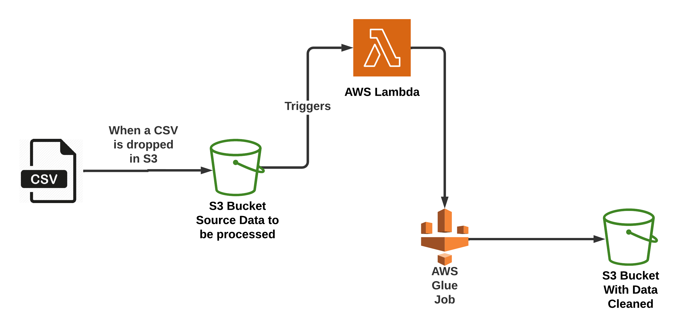

<!-- https://medium.datadriveninvestor.com/use-of-aws-glue-job-and-lambda-function-to-enhance-data-processing-703b183e5550 -->

# TERRAFORM: How to trigger a Lambda function from S3 to run Glue Job and clean up data.

# Background.
En este artículo podrás encontrar la implementación de los recursos necesarios para crear la la siguiente arquitecura en AWS para alcanzar el objetivo que se indica en el título de este documento.

La creación del codigo en terraform esta inspidada y basada en el artículo publicado por Steve George con el titulo "Use of AWS Glue Job and Lambda function to enhance data processing." Si deseas leer su artículo haz clic [aquí](https://medium.datadriveninvestor.com/use-of-aws-glue-job-and-lambda-function-to-enhance-data-processing-703b183e5550)


La implementación en terraform creará los recursos que se muestran en la arquitectura de la imagen 1.


<p style="text-align: center;">Imagen 1. Architecture.</p>

Recursos que serán creados en terraform son:

* El rol que tendra los permisos necesarios de ejecución de la función lambda y del Glue Job.
* S3 Bucket donde almacenaremos el archivo csv que procesaremos con el Glue Job
* El evento en S3 que disparará la función lambda
* La creación de la función lambda, el código en python para la función y su creación en la nube.
* La creación del job y la asignación del codigo en python.
* El S3 bucket donde almacenaremos el archivo resultante del proceso de la limpieza.

Iniciaremos con la creación del archivo `provider.tf` donde indicaremos el provedor en la nube que utilizaremos, la versión de hashicorp y la región donde desplegaremos los recursos. El archivo debe tener lo siguiente:
```
terraform {
  required_version = ">= 0.13"

  required_providers {
    aws = {
      source  = "hashicorp/aws"
      version = ">= 4.30"
    }
  }
}
provider "aws" {
  region = "us-east-2"
}
```

Ahora seguiremos con la declaración de las variables necesarias para nuestra aplicación, crea un archivo `variables.tf` que contenga lo siguiente:
```
#-----------------------------------------------------------
#                    IAM Variables
#-----------------------------------------------------------
variable "role_name" {
  description = "The name of the role"
  type        = string
}

variable "log_policy_name" {
  description = "The name of the log policy"
  type        = string
}
#-----------------------------------------------------------
#                    GLUE Variables
#-----------------------------------------------------------
variable "job_name" {
  description = "The name of the job"
  type        = string
}

variable "job_type" {
  description = "The type of the job"
  type        = string
}

variable "job_timeout" {
  description = "The timeout of the job"
  type        = string
}

variable "job_number_of_workers" {
  description = "The number of workers for the job"
  type        = string
}

variable "job_python_name" {
  description = "The name of the python script for the job"
  type        = string
}

#-----------------------------------------------------------
#                    S3 BUCKETS Variables
#-----------------------------------------------------------
variable "bucket_source_name" {
  description = "The name of the source bucket"
  type        = string
}

variable "bucket_target_name" {
  description = "The name of the target bucket"
  type        = string
}

variable "s3_acl" {
  description = "Access Control List for S3 Bucket"
  type        = string
}

variable "s3_bucket_versioning" {
  description = "S3 Bucket Versioning"
  type        = string
}

#-----------------------------------------------------------
#                   LAMBDA
#----------------------------------------------------------- 

variable "lambda_function_name" {
  description = "The name of the lambda function"
  type        = string
}

variable "lambda_runtime" {
  description = "The runtime of the lambda function"
  type        = string
}

variable "lambda_timeout" {
  description = "The timeout of the lambda function"
  type        = string
}

```
En el codigo anterior se observa que se ha dividido en secciones las variables para identificar en que archivo son utlizadas.

En AWS debemos crear un rol y asignarle los permisos minimos necesarios para las tareas que realizará nuestra aplicación.


